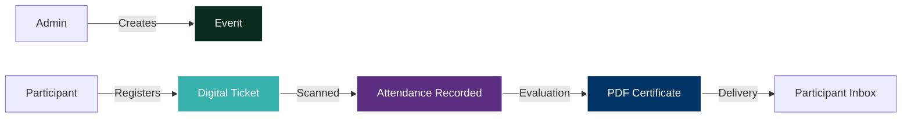

<div align="center">
  

  

  # CROSSCERT
  ### The Next-Generation Event Management & Automated Certification Platform

  <br />

  [](https://nextjs.org/)
  [](https://www.djangoproject.com/)
  [](https://tailwindcss.com/)
  [](https://www.typescriptlang.org/)

  <br />

  <p align="center">
    <strong>Elevating institutional logistics through high-performance automation.</strong><br />
    Designed exclusively for the Holy Cross of Davao College - Office of the Vice President for Academic Affairs.
  </p>
</div>

---

## Vision and Strategy
> **CROSSCERT** serves as a sophisticated bridge between institutional administration and participant experience. By digitizing the end-to-end event lifecycle—from registration to certification—we eliminate manual friction and paper-based overhead, delivering a premium, modern experience for the **Holy Cross of Davao College** community.

---

## Core Capabilities

### Advanced Event Orchestration
*   **State-Driven Management**: Fluid transitions between `Draft`, `Scheduled`, `Live`, `Paused`, and `Concluded` statuses.
*   **Dynamic Theme Engine**: Tailor event branding with departmental color schemes and immersive cover imagery.
*   **High-Impact Landing Pages**: Automatically generated, glassmorphism-inspired event hubs for every occasion.

### Secure Digital Access
*   **Encrypted QR Identification**: Instantaneous, secure participant verification via unique Digital Access Passes.
*   **Live Status Propagation**: Real-time ticket updates reflecting current event phases directly on user devices.
*   **Institutional Guardrails**: Cross-platform registration validation ensuring participant eligibility across departments.

### Intelligent Operational Logistics
*   **Sub-Second Processing**: High-throughput QR scanners designed for rapid participant check-in and check-out.
*   **Flow Validation**: Intelligent logic preventing sequence errors and ensuring accurate attendance tracking.
*   **Automated Fulfillment**: Direct integration between attendance records and post-event evaluation workflows.

### Automated Certification Engine
*   **Evaluation-Triggered Issuance**: Integrity-first certification paths that require feedback submission prior to generation.
*   **High-Fidelity PDF Core**: Proportional scaling engine ensuring ultra-high-resolution certificate output.
*   **Portfolio Integration**: Seamless automated delivery via SMTP and persistent storage in the participant's digital portfolio.

---

## Project Architecture

### Technology Stack

| Layer | Technology |
| :--- | :--- |
| **Frontend** | Next.js, TypeScript, Radix UI, Tailwind CSS |
| **Backend** | Django, Python, ReportLab (PDF) |
| **Messaging** | Automated SMTP Suite |
| **Data Architecture** | PostgreSQL / SQLite High-Performance Models |

### Codebase Organization

```text
CROSSCERT/
├── app/               # Next.js App Router (Admin, Auth, Participant)
├── backend/           # Django Services (Events, Certificates, Participants)
├── components/        # High-End Shadcn/ui & Custom Components
├── lib/               # Shared Utilities & API Orchestration
└── public/            # Optimized Static Assets & Templates
```

### System Workflow


---

## Deployment & Setup

### Prerequisites
*   Environment: Node.js 18.x, Python 3.10.x, PostgreSQL (Optional)
*   Dependencies: Git, NPM, Pip

### Quick Start

**Backend Orchestration**
```bash
cd backend
python -m venv venv
source venv/bin/activate  # or venv\Scripts\activate on Windows
pip install -r requirements.txt
python manage.py migrate
python manage.py runserver
```

**Frontend Initialization**
```bash
npm install
npm run dev
```

---

## The Development Team
*   **Engineering**: Arnado, Catherine · Asakil, Norman · Madriñan, Ashlee · Salazar, Joey · Palma, Xander
*   **Supervision**: John Rey Silverio

---

## Legal
Licensed under the **MIT License**. For detailed terms, please consult the [LICENSE](LICENSE) documentation.

<div align="center">
  <br />
  <p><strong>Excellence in Motion</strong> | Built for HCDC - VPAA</p>
</div>