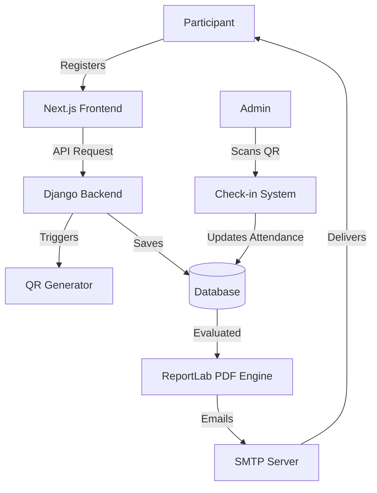

<div align="center">
  

  # CROSSCERT
  ### The Next-Generation Event Management & Automated Certification Platform

  [](https://nextjs.org/)
  [](https://www.djangoproject.com/)
  [](https://tailwindcss.com/)
  [](https://www.typescriptlang.org/)
  [](https://ui.shadcn.com/)
  [](LICENSE)

  <br />

  <p>
    A high-fidelity web ecosystem designed for the <strong>Office of the Vice President for Academic Affairs (VPAA)</strong>.
    Revolutionizing institutional seminars, workshops, and assembly logistics through intelligent automation.
  </p>
</div>

---

## The Vision
> **CROSSCERT** is more than just an event manager; it is a bridge between administrative efficiency and participant experience. By eliminating manual certification hurdles and paper-based attendance, CROSSCERT provides a seamless, high-performance environment for both institutional administrators and participants at **Holy Cross of Davao College**.

---

## Core Functionalities

### 1. Advanced Event Lifecycle Management
*   **Operational Control**: Events are managed through distinct states: `Draft`, `Scheduled`, `Live`, `Paused`, and `Concluded`.
*   **Visual Customization**: Admins can customize event branding with specialized theme engines, cover images, and departmental tagging.
*   **Interactive Hero Sections**: Immersive, high-impact landing pages for every event.

### 2. Digital Access Pass (QR Identification)
*   **Instant Identification**: Every registered participant receives a **Digital Access Pass** containing their unique QR ID.
*   **Ticket Transparency**: Real-time badge updates reflect the actual operational status on the participant's device.
*   **One-Click Registration**: Secure, cross-referenced registration ensuring only relevant students or faculty can join specific institutional events.

### 3. Intelligent Attendance Logistics
*   **High-Speed Check-In/Out**: Admin-exclusive QR scanner capable of handling massive participant inflow with sub-second processing.
*   **Smart Validations**: Prevents double check-ins and ensures participants follow the operational flow (Check-in, Presence, Check-out).
*   **Feedback Integration**: Seamlessly links physical attendance to post-event evaluations.

### 4. Automated Intelligence & Certification
*   **Evaluate-to-Earn**: Certificates are only generated once a participant completes the required evaluation form.
*   **PDF Core Engine**: High-fidelity certificate generation using a proportional scaling factor that adapts to high-resolution templates.
*   **Proactive Delivery**: Automated SMTP integration delivers certificates directly to the participant's inbox and stores them in a dedicated **Certificate Portfolio** tab.

### 5. Real-Time Analytics & Insights
*   **Live Metrics**: Instant data on attendance rates, total registrations, and certificate issuance stats.
*   **Departmental Breakdowns**: Intelligent charts visualizing engagement by college (CCJE, CET, STE, SBME, etc.).

---

## User Experience Standards
*   **Adaptive Theme Engine**: System-wide support for Light and Dark modes with smooth transitions.
*   **Bento-Grid Layouts**: Information density handled through modern, modular grid components.
*   **Proximity Notifications**: Department-based alert system ensuring relevant events reach the right audience.
*   **Mobile-First Design**: Optimized for smartphones, ensuring both administrators and participants can access tools on the move.

---

## Project Architecture

### Codebase Mapping

| Component | Responsibility |
| :--- | :--- |
| **app/** | Next.js App Router: Pages, API Routes, and Layouts |
| **components/** | Shadcn/ui and custom reusable UI components |
| **lib/** | Shared utilities, API clients, and business logic |
| **backend/certificates/** | PDF generation engine and automated mailers |
| **backend/events/** | Core event lifecycle and status orchestration |
| **backend/participants/** | Registration management and attendance records |

### Technical Architecture


---

## Getting Started

### Prerequisites
*   Node.js 18+
*   Python 3.10+
*   Git

### Installation

#### 1. Backend Setup
```powershell
cd backend
python -m venv venv
.\venv\Scripts\activate
pip install -r requirements.txt
python manage.py migrate
python manage.py runserver
```

#### 2. Frontend Setup
```powershell
npm install
npm run dev
```

---

## System Operations Flow

### Phase 1: Preparation
1.  Admin creates an event and selects a **Departmental Theme**.
2.  System generates a registration endpoint.
3.  Participants discover the event on their dashboard.

### Phase 2: Execution
1.  Participant registers and receives a **Digital Ticket**.
2.  Admin starts the event; tickets update to **Live Access Passes**.
3.  QR scanning records attendance.

### Phase 3: Fulfillment
1.  Event concludes; participants access the **Evaluation Modal**.
2.  Upon submission, the system generates the PDF certificate.
3.  Automated mailer dispatches the certificate to the participant.

---

## The Development Team

*   **Developers**: Arnado, Catherine · Asakil, Norman · Madriñan, Ashlee · Salazar, Joey · Palma, Xander
*   **Adviser**: John Rey Silverio

---

## License
This project is licensed under the MIT License - see the [LICENSE](LICENSE) file for details.

<div align="center">
  <p>Built for <strong>HCDC - VPAA</strong></p>
</div>