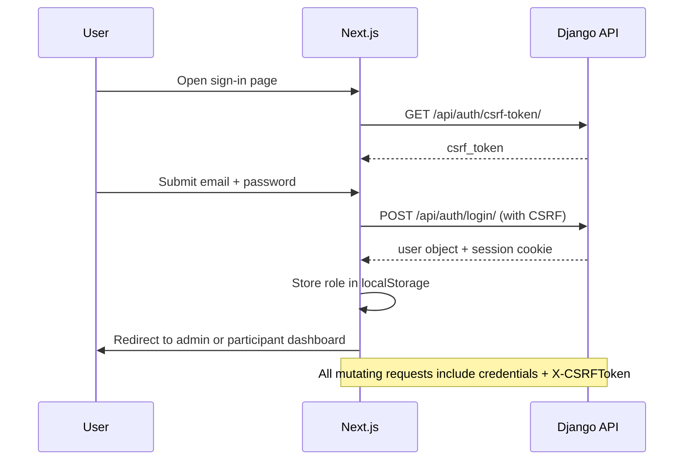
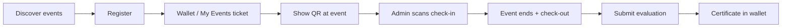

# CROSSCERT — How the Web App Works

CROSSCERT is a full-stack event management and certificate automation platform for Holy Cross of Davao College (HCDC). The **Next.js frontend** (Vercel) talks to a **Django REST API** (Render) over HTTPS with session cookies and CSRF tokens.

---

## Architecture Overview

```
┌─────────────┐     HTTPS + cookies      ┌──────────────────┐
│   Browser   │ ◄──────────────────────► │  Next.js (Vercel) │
│  (User UI)  │                          │  App Router       │
└──────┬──────┘                          └─────────┬─────────┘
       │                                            │
       │  fetch(..., credentials: 'include')        │
       ▼                                            ▼
┌──────────────────────────────────────────────────────────────┐
│                    Django REST API (Render)                   │
│  Rate limit → Cache (Redis/Upstash) → Views → SQLite/PG      │
└──────────────────────────────────────────────────────────────┘
       │
       ▼
┌──────────────┐    ┌─────────────┐    ┌─────────────────────┐
│  PostgreSQL  │    │   Upstash   │    │  Gmail SMTP (email) │
│  (Supabase)  │    │    Redis    │    │                     │
└──────────────┘    └─────────────┘    └─────────────────────┘
```

---

## User Roles

| Role | How identified | Main areas |
|------|----------------|------------|
| **Admin** | `user.is_staff === true` → `localStorage.userRole = 'admin'` | `/admin/*` |
| **Participant** | Regular signed-in user | `/participant/*` |
| **Public** | Not signed in | `/`, `/discover`, public event pages |

> Route protection is **client-side** (layout checks). The API enforces real permissions.

---

## Authentication Flow



**Signup (participants only):**
1. `POST /api/participants/register/` with `@hcdc.edu.ph` email
2. Creates Django `User` + `UserProfile` (department, program)
3. User signs in separately

**Password reset:** OTP emailed → verify → reset token → new password (OTP stored in server memory for now)

---

## Admin Workflow

### 1. Create an event (6-step wizard)

Path: `/admin/events/create`

| Step | What happens |
|------|----------------|
| 1 | Event name, date (≥2 days ahead), time, venue, department |
| 2 | Options: public, capacity, paid event, etc. |
| 3 | Certificate template upload (image) |
| 4 | Map text fields on certificate (name, date, title coordinates) |
| 5 | Pick visual theme (Light, Dark, Black, etc.) |
| 6 | Preview + publish → `POST /api/events/` |

Backend on create:
- Assigns organizer, generates registration URL + code prefix
- Sends “event created” email to organizer
- Invalidates event cache

State is managed by `create-event-wizard-context.tsx` (React Context holding all wizard state and handlers).

### 2. Run the event (live)

- Admin sets event status to **live**
- Participants who registered receive a unique pass code: `PREFIX-000123`
- QR is generated on the frontend from `qr_code_value`

### 3. Check-in guests

Path: `/admin/checkin`

```
Pick event → Open camera → Scan QR → API validates code
    → POST /api/check-ins/check-in-by-code/
    → Wallet-style success modal (name, event, QR, timestamp)
    → Stats panel updates (checked in / expected / attendance %)
```

Duplicate scan → “Already verified” modal (same card UI).

### 4. Conclude event

- `POST /api/events/{id}/conclude/` → status = `completed`
- Enables check-out flow

### 5. Check-out + evaluation trigger

- Scan same QR at check-in page (when event completed)
- `POST /api/check-ins/check-out-by-code/`
- Backend emails evaluation link to participant

### 6. Certificates

- Participant submits evaluation → backend auto-generates PDF (ReportLab)
- Certificate stored as base64, emailed, shown in participant wallet
- Admin can also bulk-generate from `/admin/certificates`

---

## Participant Workflow



| Feature | Path | API |
|---------|------|-----|
| Browse events | `/participant/events` | `GET /api/events/` |
| Bookmark | Heart icon | `POST /api/bookmarks/toggle/` |
| Register | Event detail | `POST /api/registrations/` |
| Wallet (tickets + certs) | `/participant/wallet` | registrations + `GET /api/certificates/my_certificates/` |
| QR ticket | `/participant/event/[id]/qrcode` | registration by email |
| Evaluation | `/participant/event/[id]/evaluation` | `POST /api/evaluations/` |
| Certificates | `/participant/certificates` | download endpoint |

---

## Key API Routes

| Method | Path | Purpose |
|--------|------|---------|
| GET | `/api/health/` | Liveness probe |
| POST | `/api/auth/login/` | Sign in |
| GET | `/api/auth/me/` | Current user (cached) |
| GET/POST | `/api/events/` | List / create events |
| POST | `/api/registrations/` | Register for event |
| POST | `/api/check-ins/check-in-by-code/` | QR check-in |
| POST | `/api/check-ins/check-out-by-code/` | QR check-out |
| POST | `/api/evaluations/` | Submit feedback |
| GET | `/api/certificates/my_certificates/` | Participant certs |
| POST | `/api/bookmarks/toggle/` | Server-synced bookmarks |

---

## Email Automation

| Trigger | Email |
|---------|-------|
| Registration | Confirmation with event details |
| First check-in | Attendance confirmation |
| Check-out | Evaluation link |
| Evaluation submitted | Certificate ready + attachment |
| Event created | Notify organizer |
| Forgot password | OTP code |

---

## Caching & Rate Limiting (Production)

**Cache (Redis / Upstash):**
- Event list (2 min)
- Event detail + certificate template fields (5 min)
- User profile `/api/auth/me/` (1 min)

**Rate limits:**
- Login: 10/min per IP
- Create event: 20/hour per user
- Certificate preview / generate: hourly caps

Set on Render:
```env
UPSTASH_REDIS_REST_URL=https://....upstash.io
UPSTASH_REDIS_REST_TOKEN=your_token
```

---

## Frontend ↔ Backend Config

```env
# .env.local (frontend)
NEXT_PUBLIC_API_URL=http://localhost:8000

# backend/.env
DEBUG=True
FRONTEND_BASE_URL=http://localhost:3000
UPSTASH_REDIS_REST_URL=...
UPSTASH_REDIS_REST_TOKEN=...
```

API client: `lib/api-config.ts` — `apiCall` wraps fetch with CSRF retry on 403.

---

## Local Development

```bash
# Terminal 1 — Backend
cd backend
.\venv\Scripts\Activate.ps1
python manage.py runserver

# Terminal 2 — Frontend
npm run dev
```

Open `http://localhost:3000` → sign in → use admin or participant flows above.

---

## Deployment

| Layer | Platform |
|-------|----------|
| Frontend | Vercel |
| Backend | Render |
| Database | Supabase PostgreSQL (prod) / SQLite (local) |
| Cache | Upstash Redis |
| Email | Gmail SMTP |

After deploy: set `CSRF_TRUSTED_ORIGINS`, `FRONTEND_BASE_URL`, Redis env vars on Render; `NEXT_PUBLIC_API_URL` on Vercel.
